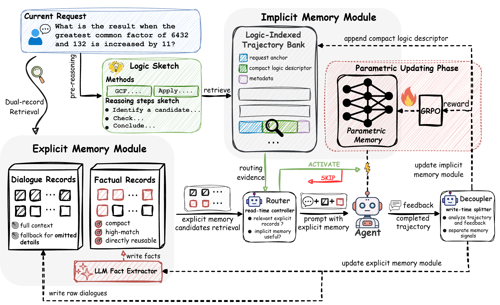
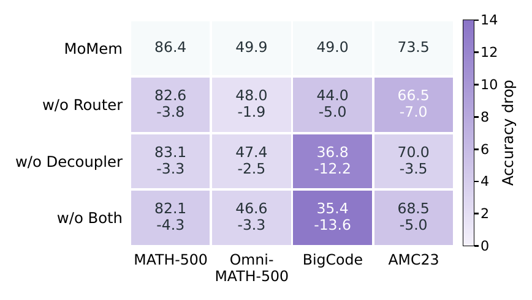
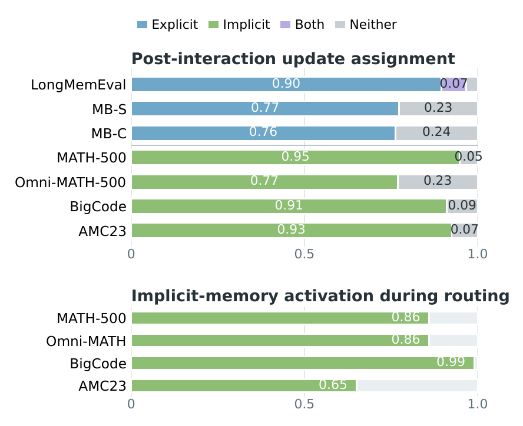

# MoMem

MoMem is a mixture-of-memory architecture for lifelong LLM agents. It separates factual memory and experiential memory into explicit and implicit pathways, then uses a router and a decoupler to decide what to retrieve, what to update, and when to activate the LoRA-backed experience path.

This release tree is anonymized and intentionally keeps only the core package, helper examples, paper PDF, and paper figures. It omits datasets, checkpoints, experiment logs, notebooks, and private paths.

## Paper At A Glance



MoMem has two control points:

1. The router selects relevant factual memories and decides whether the implicit experience path should activate.
2. The decoupler splits each interaction into reusable text records and reusable reasoning experience.

Headline numbers reported in the camera-ready abstract:

| Claim | Value |
| --- | ---: |
| LongMemEval | 51.4 |
| Gain over strongest baseline on LongMemEval | +11.7 |
| MATH-500 | 86.4 |
| Gain over backbone on MATH-500 | +3.2 |

The paper also shows that the gain comes from routing and decoupling, not from simply storing more memory.





These previews are rendered from the camera-ready figure PDFs in `assets/figures/`.

## What Is Included

- `MoMem/`: the release package for the memory architecture
- `examples/reward_functions.py`: reusable reward templates for GRPO
- `examples/evaluate_longmemevo.py`: a lightweight evaluation script
- `assets/figures/`: paper figures used in this README
- [paper/MoMem_camera_ready.pdf](paper/MoMem_camera_ready.pdf): the camera-ready paper

## Installation

```bash
pip install -r requirements.txt
pip install -e .
```

The release keeps the remote OpenAI path fixed to GPT-5.4. You only need:

```bash
export OPENAI_API_KEY="..."
export OPENAI_BASE_URL="https://api.openai.com/v1"
export MOMEM_MEMORY_DIR="$HOME/.cache/momem"
```

Optional local-backend variables:

```bash
export VLLM_BASE_URL="http://127.0.0.1:8090"
export VLLM_MODEL_NAME="Qwen/Qwen2.5-7B-Instruct"
```

The explicit-memory stack uses an Ollama embedder by default, so first-time setup should also make sure the embedding model is available:

```bash
ollama pull qwen3-embedding:0.6b
ollama serve
```

## Inference

```python
from MoMem import MoMem

agent = MoMem(
    base_model="Qwen/Qwen2.5-7B-Instruct",
    lora_path="./outputs/implicit_memory_lora_adapter",
    need_grpo=False,
)

reply = agent.chat_with_mem(
    "Answer the user request here.",
    user_id="example_user",
)
print(reply)
agent.close()
```

`user_id`, `agent_id`, and `run_id` let you scope memory per user, agent, or run.
If the LoRA path does not exist yet, the model falls back to the base model.

## Training With GRPO

```python
from MoMem import MoMem
from examples.reward_functions import dispatch_reward

agent = MoMem(
    base_model="Qwen/Qwen2.5-7B-Instruct",
    lora_path="./outputs/implicit_memory_lora_adapter",
    need_grpo=True,
    reward_func=dispatch_reward,
    reward_name="dispatch_reward",
)
```

`reward_func` should return one float per completion. The helper functions in `examples/reward_functions.py` are written to normalize common completion shapes and accept extra `**kwargs` from the trainer.

Default sample fields used by `OnlineGRPO`:

- prompt fields: `messages`, `prompt`, `question`, `problem`
- answer fields: `gold_answer`, `answer`, `solution`, `final_answer`

If your dataset uses different field names, rename them before training or instantiate `OnlineGRPO` directly with custom field lists.

## Choosing A Reward Function

Import the helpers like this:

```python
from examples.reward_functions import (
    dispatch_reward,
    exact_match_reward,
    execution_reward_template,
    majority_vote_reward,
    numeric_exact_match_reward,
    verifier_reward,
)
```

Recommended use by environment:

| Environment | Helper | Notes |
| --- | --- | --- |
| Factual QA / retrieval | `exact_match_reward` | Best when you have a gold short answer. |
| Math / scalar reasoning | `numeric_exact_match_reward` | Extracts the final numeric answer before matching. |
| Self-consistency / multi-sample setup | `majority_vote_reward` | Reward the consensus completion for the same prompt. |
| Judge-backed benchmark | `verifier_reward` | Pass through verifier or judge scores. |
| Code / tool / execution tasks | `execution_reward_template` | Plug in your own sandbox or unit-test runner. |
| Mixed tasks | `dispatch_reward` | Routes by `gold_answer`, `verifier_scores`, `runner`, or `task_type`. |

Typical custom wrapper:

```python
def code_reward(completions, **kwargs):
    return execution_reward_template(completions, runner=my_runner, **kwargs)
```

For mixed datasets, add `task_type` or `dataset_name` to the sample metadata when your trainer forwards those fields. The dispatcher will then pick the right reward path without you writing a new reward from scratch each time.

## LongMemEval Example

```bash
python examples/evaluate_longmemevo.py \
  --dataset-path /path/to/longmemeval_s_cleaned_fixed.json \
  --agent-backend remote \
  --max-samples 100 \
  --output outputs/longmemevo_eval.json
```

The remote OpenAI path always uses GPT-5.4 in this release. Use `--agent-backend local` and `--agent-model` only if you want the optional local vLLM path.

## Paper

The camera-ready PDF is included here:

- [paper/MoMem_camera_ready.pdf](paper/MoMem_camera_ready.pdf)

## Citation

If you use this repository, please cite:

`MoMem: Decoupling Factual and Experiential Memory for Lifelong LLM Agents`
